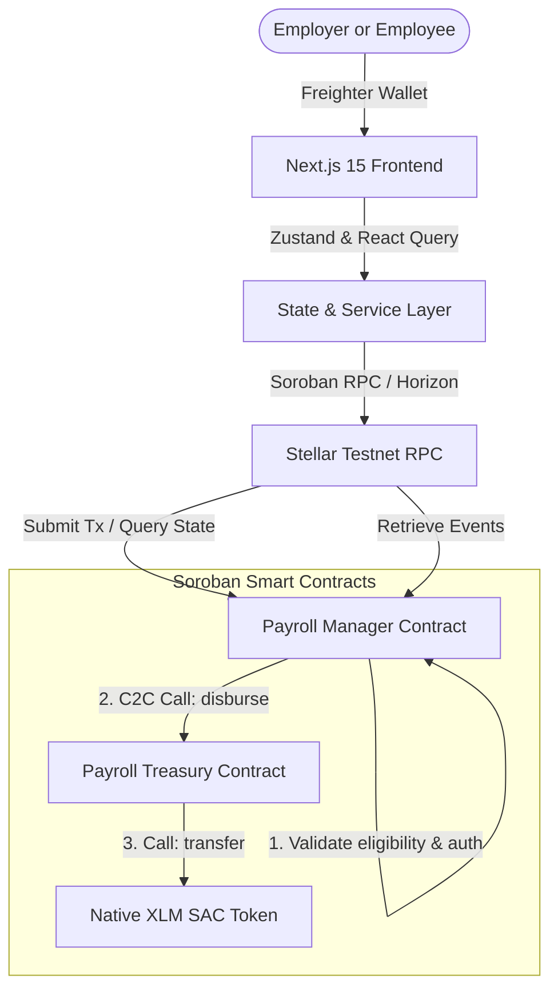
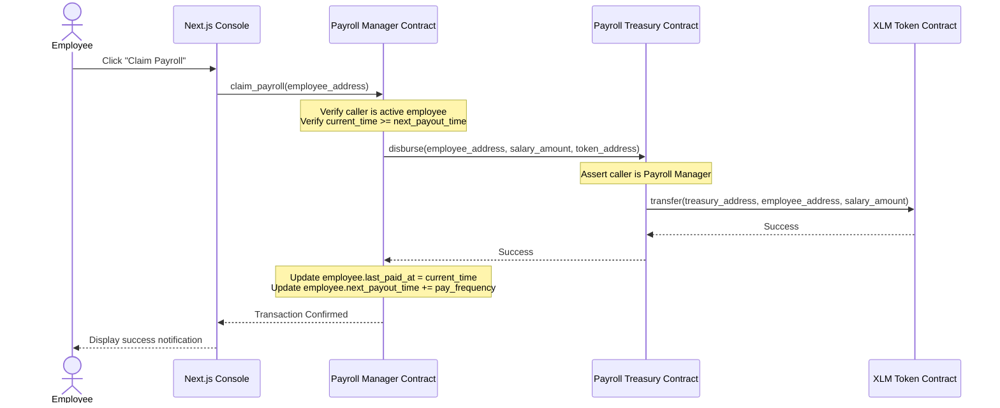

# StellarPay: Decentralized Payroll & Treasury Vault Console

A polished Next.js 15 operator dashboard for a Soroban smart contract ecosystem that lets company admins register employees, manage treasury funding allocations, release time-locked salary claims, and inspect real-time on-chain logs from a single unified console.

---

# Product Overview

Managing global team payroll transparently and on time is a core operational challenge. Legacy centralized payroll processors introduce high transfer fees, delayed cross-border clearances, and single-point-of-failure vulnerabilities. 

**StellarPay** solves this by establishing a decentralized payroll management system built on the Stellar network. It provides a secure, automated, and tamper-proof structure where employers can commit funds into a dedicated on-chain Treasury vault, and employees can verify their details and claim salaries directly to their Freighter wallets according to their frequency rules.

---

# Architecture Diagram

The system employs a modular, secure smart contract architecture to segregate concerns:



---

# Smart Contract Design

StellarPay splits business logic and asset storage into two separate contracts:

1. **`payroll-treasury`**: Handles the vault and disbursements.
   - Enforces that only the registered `payroll-manager` contract is authorized to trigger `disburse` operations.
   - Tracks total deposits, total disbursements, and vault balances on-chain.
   - Allows the contract admin (owner) to safely deposit and withdraw funds.
2. **`payroll-manager`**: Core payroll logic, access control, and employee directory.
   - Defines the custom storage structure `Employee` containing the address, salary rate, payout interval frequency (in seconds), next payout eligibility timestamp, active/inactive status, role title, and last payment timestamp.
   - Restricts employee additions, updates, and terminations to the contract Admin.
   - Allows employees to trigger `claim_payroll` once their payout interval timer has elapsed.

---

# Inter-Contract Communication Flow

The interaction between the manager and treasury contracts is detailed below:



- **Permission Verification**: The `payroll-treasury` contract checks if the caller matches the stored `manager_id` before performing any disbursements.
- **Event Propagation**: Detailed events are emitted by both contracts at each step of the pipeline.

---

# Features

- **Treasury Vault Management**: Fund the vault directly using XLM and monitor available balance.
- **Access Control & Permissions**: Strict role-based security separating admin actions from employee claims.
- **On-Chain Employee Registry**: Register and terminate employee profiles dynamically.
- **Time-Locked Payout Intervals**: Set customized payment periods (from 1 minute for test loop up to monthly) and lock payouts until they are due.
- **Real-Time Event Streaming**: Automatically poll and render contract-emitted events in an Activity Feed without manual refresh.
- **Production Transaction Queue**: Monitor the complete lifecycle of pending, processing, confirmed, and failed blockchain transactions.
- **Freighter Wallet Integration**: Connect and disconnect Freighter wallet, switch networks, and handle account updates instantly.
- **Mobile Responsive Design**: Clean, minimal, adaptive whitish design with no gradients, fully usable across desktop, tablet, and mobile browsers.

---

# Tech Stack

- **Core Framework**: [Next.js 15](https://nextjs.org/) (App Router, TypeScript)
- **State Store**: [Zustand v5](https://github.com/pmndrs/zustand)
- **Server Cache & Synchronization**: [React Query v5](https://tanstack.com/query/latest)
- **Styling**: [Tailwind CSS v4](https://tailwindcss.com/) (Minimalist Whitish aesthetic with flat borders and bright orange accents)
- **Smart Contracts**: [Soroban SDK v26](https://soroban.stellar.org/)
- **Wallet Connection**: [@creit.tech/stellar-wallets-kit](https://github.com/CreitTech/stellar-wallets-kit)

## Contract Explorer

- **Stellar Expert (Payroll Manager Contract)**: https://stellar.expert/explorer/testnet/contract/CBBAYELR73ZFT2WLSD2AG2MSZXLT3ADBRHQSRJY3HARKSCF5PBNYAAYN
- **Stellar Expert (Payroll Treasury Contract)**: https://stellar.expert/explorer/testnet/contract/CDMJGW3GLJXEBMYW7LPITW22LGMVAO7ZE2QISI7MIJCGFNGVV42N7B4B

---

# Environment Variables

Create a `.env.local` file in the root directory:

```env
NEXT_PUBLIC_MANAGER_CONTRACT_ID=CBBAYELR73ZFT2WLSD2AG2MSZXLT3ADBRHQSRJY3HARKSCF5PBNYAAYN
NEXT_PUBLIC_TREASURY_CONTRACT_ID=CDMJGW3GLJXEBMYW7LPITW22LGMVAO7ZE2QISI7MIJCGFNGVV42N7B4B
NEXT_PUBLIC_TOKEN_CONTRACT_ID=CACUJUEJWSNL544KHIGNSVBPRR33ZY3RGMRQHIMAK3VBFSTDPLYAC3T7
NEXT_PUBLIC_STELLAR_NETWORK=testnet
NEXT_PUBLIC_SOROBAN_RPC_URL=https://soroban-testnet.stellar.org
```

---

# Local Development

### 1. Install Dependencies
```bash
npm install --ignore-scripts
```

### 2. Run Next.js Development Server
```bash
npm run dev
```
Open `http://localhost:3000` to view the console.

### 3. Build Production Target
```bash
npm run build
```

---

# Testing

### Run Smart Contract Rust Tests
```bash
$env:PATH="C:\Users\debji\.rustup\toolchains\stable-x86_64-pc-windows-gnu\lib\rustlib\x86_64-pc-windows-gnu\bin\self-contained;$env:PATH"
cargo test --offline
```

### Run Frontend Unit & Integration Tests
```bash
npm run test
```

---

# CI/CD

Automated pipelines are configured using GitHub Actions:

- **Pull Request Workflow ([pr.yml](.github/workflows/pr.yml))**: Automatically installs dependencies, runs linter rules, type checks TypeScript files, and runs the Vitest suite on any PR target.
- **Deployment Workflow ([deploy.yml](.github/workflows/deploy.yml))**: Executes tests, compiles smart contracts, and verifies production web bundle builds when changes merge to `main`.

---

# Deployment

### Vercel Deployment
To deploy the frontend to Vercel, run:
```bash
npx vercel --prod --yes
```

### Contract Deployment
The deployment script is located in `scripts/deploy.js`. It automates building, deploying WASM to Testnet, initializing instances, and cross-linking addresses.

---

# Security Considerations

1. **Access Control**: All state-modifying functions (like adding employees or withdrawing from treasury) check that the transaction sender matches the Admin address.
2. **Contract-to-Contract Security**: The treasury contract strictly checks that the caller of `disburse` is the authorized manager contract address.
3. **Reentrancy and Timing protection**: Double claims are prevented by requiring `ledger_timestamp >= next_payout_time`, and updating state *before* confirming claims.
4. **Environment protection**: All sensitive network variables are configured via standard public env bindings.

---

# Project Deployments

### Contract Addresses
- **Payroll Manager Contract ID**: `CBBAYELR73ZFT2WLSD2AG2MSZXLT3ADBRHQSRJY3HARKSCF5PBNYAAYN`
- **Payroll Treasury Contract ID**: `CDMJGW3GLJXEBMYW7LPITW22LGMVAO7ZE2QISI7MIJCGFNGVV42N7B4B`
- **XLM SAC Token Address**: `CACUJUEJWSNL544KHIGNSVBPRR33ZY3RGMRQHIMAK3VBFSTDPLYAC3T7`

### Transaction Hash
- **Treasury Init Transaction**: `f1efdc3ec01572ef31de82e99ce579cc81895e3b047c9a90fb97e3b264492d82`
- **Manager Init Transaction**: `ba036a888f70a9f094c1a310c8921b4b15279679ba37e444ac0315141b6d15b3`

### Live Demo
- **Vercel Production Site**: https://level3-rosy.vercel.app
